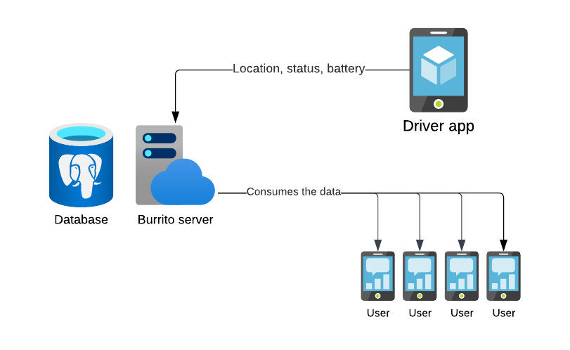

<!-- markdownlint-disable MD033 -->

# Resumen

A continuación, se presenta una descripción general del proyecto Contigo Burrito y cómo
sus componentes interactúan entre sí. Para información más detallada, consulta la
documentación específica de cada componente.

## Componentes

El proyecto está dividido en cuatro componentes principales, cada uno con su propio
repositorio:

<table>
  <thead>
    <tr>
      <th>Repositorio</th>
      <th>Descripción</th>
      <th>Tecnologías</th>
    </tr>
  </thead>
<tbody>
  <tr>
    <td><a href="https://github.com/burrito-project/burrito-app">burrito-app</a></td>
    <td>La app que los estudiantes usan para verificar el estado del autobús.</td>
    <td>Flutter, Riverpod, Google Maps</td>
  </tr>
  <tr>
    <td><a href="https://github.com/burrito-project/burrito-server">burrito-server</a></td>
    <td>Servidor REST API responsable.</td>
    <td>Rust, Rocket</td>
  </tr>
  <tr>
    <td><a href="https://github.com/burrito-project/burrito-driver">burrito-driver</a></td>
    <td>Aplicación para el conductor del autobús que envía datos de ubicación.</td>
    <td>Flutter, Geolocator</td>
  </tr>
  <tr>
    <td><a href="https://github.com/burrito-project/burrito-dashboard">burrito-dashboard</a></td>
    <td>Panel de administración para interactuar con el sistema.</td>
    <td>Vite, React</td>
  </tr>
</tbody>
</table>

Ten en cuenta que estos son repositorios privados, por lo que es posible que
necesites solicitar acceso a ellos.

## Arquitectura

El proyecto sigue una arquitectura cliente-servidor, donde el servidor y la aplicación
del conductor son responsables de gestionar los datos y los clientes se encargan
de mostrarlos.

